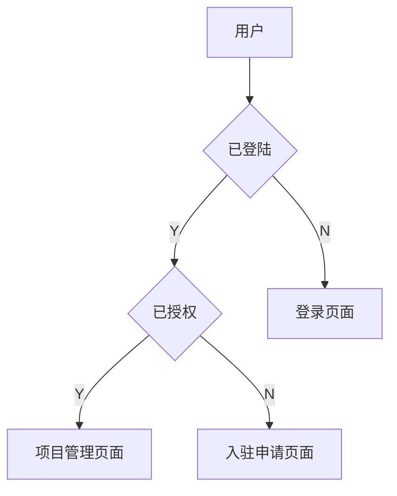

Blog posts support [Docusaurus Markdown features](https://docusaurus.io/docs/markdown-features), such as [MDX](https://mdxjs.com/).

:::tip

Use the power of React to create interactive blog posts.

```js
<button onClick={() => alert('button clicked!')}>Click me!</button>
```

<button onClick={() => alert('button clicked!')}>Click me!</button>

:::

