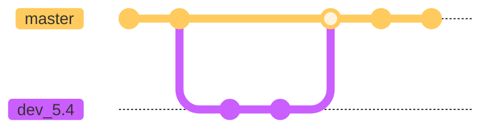
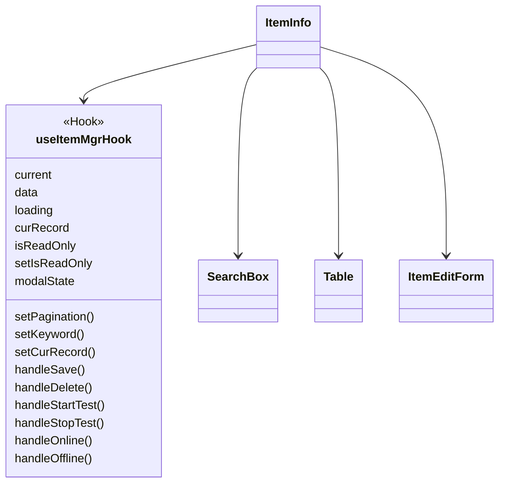

# 运营后台道具管理前端设计

### overview

```mermaid
    %%{init: { 'logLevel': 'debug', 'theme': 'base', 'gitGraph': {'showBranches': true, 'showCommitLabel':false,'mainBranchName': 'master'}} }%%
    gitGraph
       commit
       commit
       branch dev_5.4
       checkout dev_5.4
       commit
       commit
       checkout master
       merge dev_5.4
       commit
       commit
```

```mermaid
classDiagram

class ItemInfo {
	
}
class SearchBox{
	
}

ItemInfo --> useItemMgrHook
ItemInfo --> SearchBox
ItemInfo --> Table
ItemInfo --> ItemEditForm

class useItemMgrHook{
    <<Hook>>
    current
        data
        loading
        setPagination()
        setKeyword()
        curRecord
        setCurRecord()
        isReadOnly
        setIsReadOnly
        handleSave()
        handleDelete()
        handleStartTest()
        handleStopTest()
        handleOnline()
        handleOffline()
        modalState
}


```