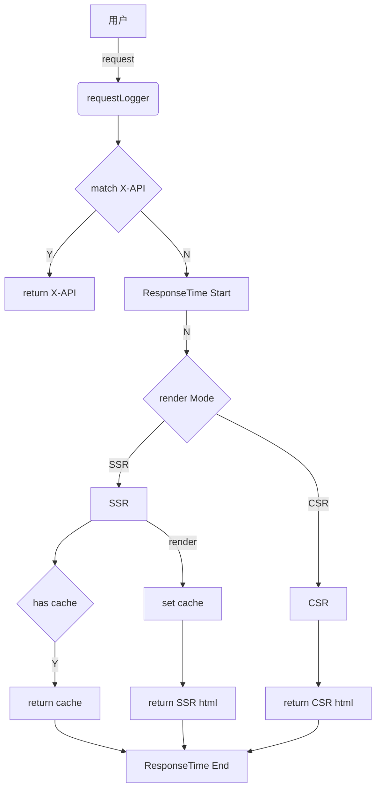
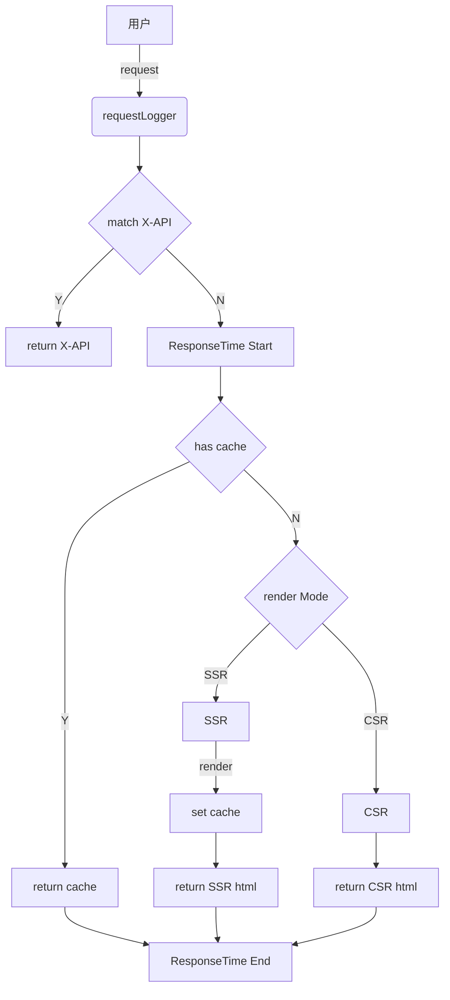

# MainSite 分析
## 请求处理流程
### Before

```mermaid
graph TD
    A[用户] -->|request| B(requestLogger)
    B --> C{match X-API}
    C -->|Y| D[return X-API]
    C -->|N| E[ResponseTime Start]
    E --> |N|H{render Mode}
    F --> |Y|G[return cache]
    G --> L[ResponseTime End]
   
    H --> |SSR|I[SSR]
    I --> F{has cache}
    I --> |render|M[set cache]
    M --> M1[return SSR html]
    M1 --> L[ResponseTime End]
    H --> |CSR|J[CSR]
    J --> K[return CSR html]
    K --> L[ResponseTime End]
```
### After

```mermaid
graph TD
    A[用户] -->|request| B(requestLogger)
    B --> C{match X-API}
    C -->|Y| D[return X-API]
    C -->|N| E[ResponseTime Start]
    E --> F{has cache}
    F --> |Y|G[return cache]
    G --> L[ResponseTime End]
    F --> |N|H{render Mode}
    H --> |SSR|I[SSR]
    I --> |render|M[set cache]
    M --> M1[return SSR html]
    M1 --> L[ResponseTime End]
    H --> |CSR|J[CSR]
    J --> K[return CSR html]
    K --> L[ResponseTime End]
```

