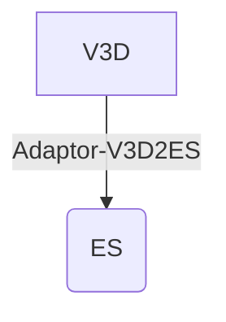
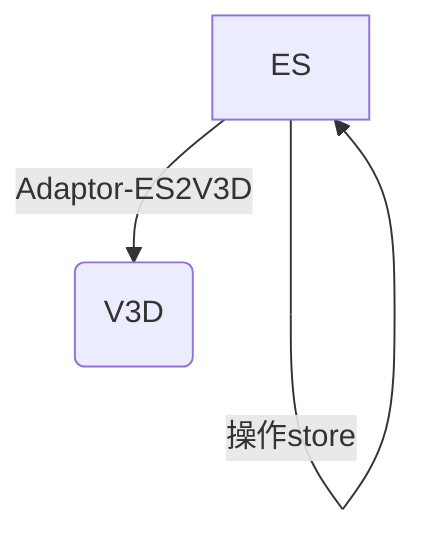
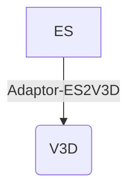
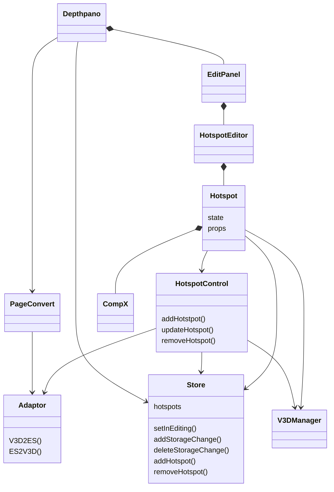
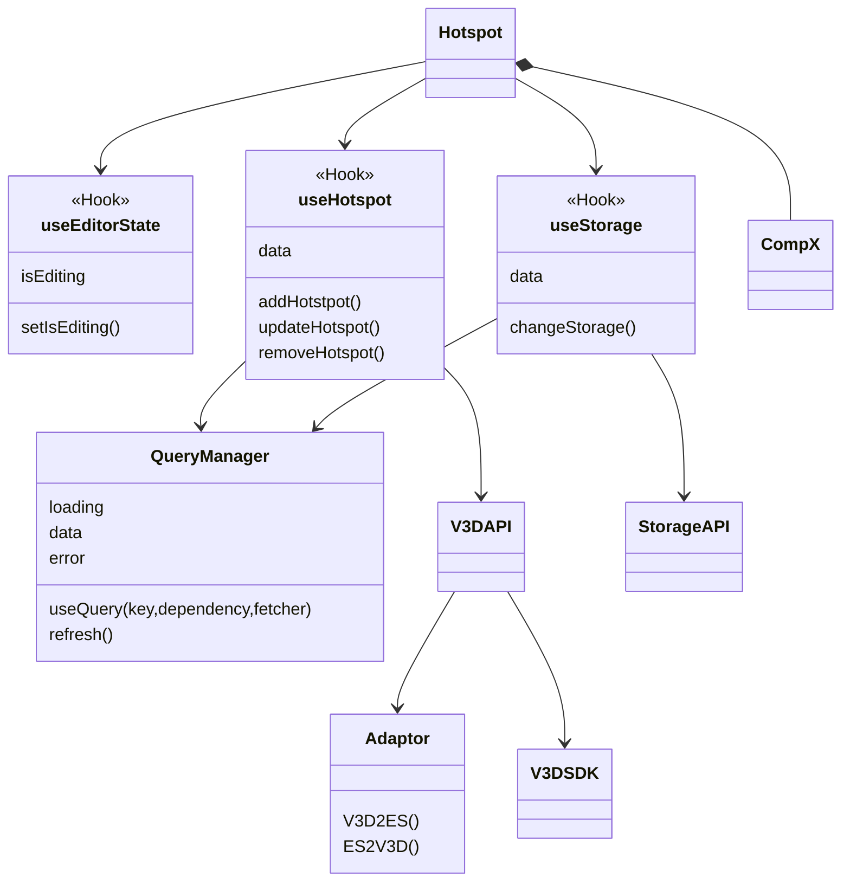
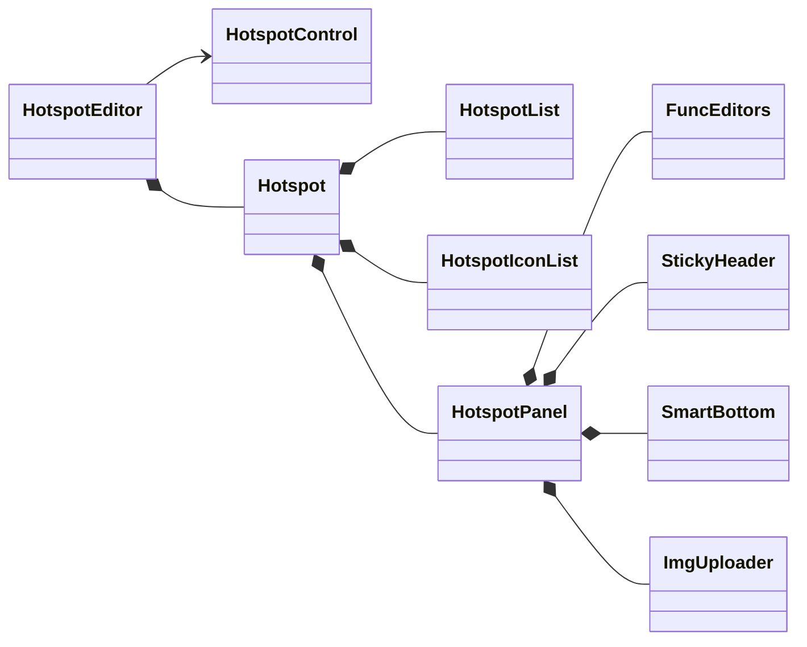
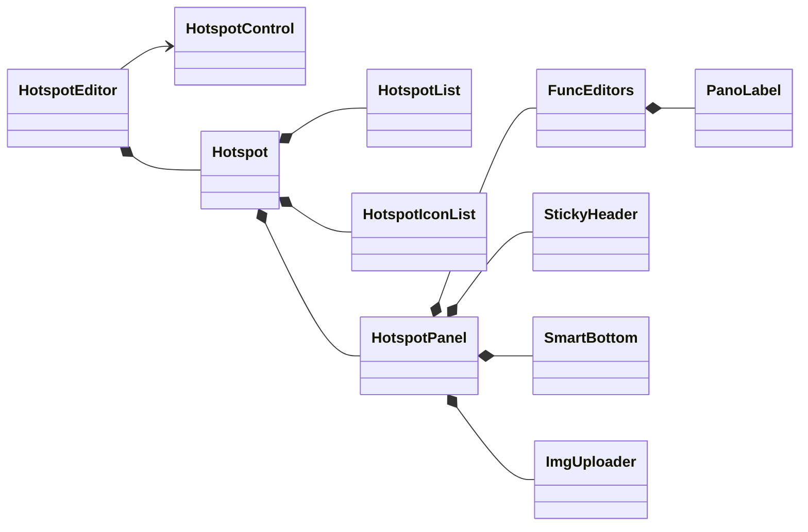

# VRCC 分析
## 数据流向问题
### 现状
读

```mermaid
graph TD
    A[V3D] -->|Adaptor-V3D2ES| B(ES)
```
写

```mermaid
graph TD
    A[ES] -->|Adaptor-ES2V3D| B(V3D)
    A --> |操作store|A
```
### 理想
读

```mermaid
graph TD
    A[V3D] -->|Adaptor-V3D2ES| B(ES)
```
写

```mermaid
graph TD
    A[ES] -->|Adaptor-ES2V3D| B(V3D)
```

### case1,现状

```mermaid
classDiagram

Depthpano *-- EditPanel
EditPanel *-- HotspotEditor
Depthpano --> PageConvert
Depthpano --> Store
HotspotEditor *-- Hotspot
Hotspot --> HotspotControl
class Adaptor{
    V3D2ES()
    ES2V3D()
}
PageConvert --> Adaptor
HotspotControl --> Adaptor
HotspotControl --> Store
HotspotControl --> V3DManager
class HotspotControl{
    addHotstpot()
    updateHotspot()
    removeHotspot()
}

class Hotspot{
    state
    props
}
Hotspot --> Store
class Store{
    hotspots
    setInEditing()
    addStorageChange()
    deleteStorageChange()
    addHotspot()
    removeHotspot()
}
Hotspot --> V3DManager
Hotspot *-- CompX
```

### case2,新方案

```mermaid
classDiagram

class Hotspot{
    
}
Hotspot --> useEditorState
class useHotspot{
    <<Hook>>
    data
    addHotstpot()
    updateHotspot()
    removeHotspot()
}
class useStorage{
    <<Hook>>
    data
    changeStorage()
}
class useEditorState{
    <<Hook>>
    isEditing
    setIsEditing()
}
Hotspot --> useHotspot
Hotspot --> useStorage
useHotspot --> QueryManager
class QueryManager{
     loading
    data
    error
    useQuery(key,dependency,fetcher)
    refresh()
}
useHotspot --> V3DAPI
useStorage --> StorageAPI
useStorage --> QueryManager
class Adaptor{
    V3D2ES()
    ES2V3D()
}
V3DAPI --> Adaptor
V3DAPI --> V3DSDK
Hotspot *-- CompX
```

## Depthpano.Hotspot

```mermaid
classDiagram
 direction LR
    class HotspotEditor{

    }

    class HotspotControl{
	
    }

    class HotspotList{

    }

    

    Hotspot *-- HotspotList
    Hotspot *-- HotspotIconList
    Hotspot *-- HotspotPanel
    
    HotspotEditor *-- Hotspot
    HotspotEditor --> HotspotControl
    HotspotPanel *-- FuncEditors
    HotspotPanel *-- StickyHeader
    HotspotPanel *-- SmartBottom
    HotspotPanel *-- ImgUploader

```

## Depthpano.Hotspot.Editors

```mermaid
classDiagram
 direction LR
   

    
    %% 各种Editor
    FuncEditors *-- PanoSwitch
    PanoSwitch --> ViewSelect
    PanoSwitch --> V3DViewer
    PanoSwitch --> Manager_V3DManager
    PanoSwitch --> Toast
    PanoSwitch --> LayoutBaseComponent
    
    FuncEditors *-- PanoLabel

    FuncEditors *-- PanoText
    PanoText --> LinkInformation

    FuncEditors *-- PanoArticle
    PanoArticle --> simpleUploadArticle
    PanoArticle --> RichText
    PanoArticle --> Icon

    FuncEditors *-- PanoPicture
    PanoPicture --> ImgUploadGrid
    PanoPicture --> LinkInformation
    PanoPicture --> ImageEffect

    
    FuncEditors *-- PanoGraphic
    PanoGraphic --> Util_sillegalUrl
    PanoGraphic --> AudioItem

    FuncEditors *-- PanoLink
    PanoLink --> Util_sillegalUrl

    FuncEditors *-- PanoAudio
    PanoAudio --> AudioItem

    FuncEditors *-- PanoVideo
    PanoVideo --> LinkInformation

    FuncEditors *-- PanoSpin
    PanoSpin --> MaterialsSelect
    

    FuncEditors *-- SpinGraphic
    SpinGraphic --> Gallery
    SpinGraphic --> Utils_commonTools

    
    FuncEditors *-- SpinVideo
    SpinVideo --> Utils_dataParser
    
    FuncEditors *-- DepthpanoPicture
    DepthpanoPicture --> ImgUploadGrid
    DepthpanoPicture --> LinkInformation
    DepthpanoPicture --> SceneSelect
    
    FuncEditors *-- DepthpanoVideo
    DepthpanoVideo --> LinkInformation
    DepthpanoVideo --> SceneSelect
    
    FuncEditors *-- DepthpanoText
    DepthpanoText --> LinkInformation
    DepthpanoText --> SceneSelect
    
    FuncEditors *-- DepthpanoGraphic
    DepthpanoGraphic --> LinkInformation
    DepthpanoGraphic --> AudioItem
    DepthpanoGraphic --> ImgUploadGrid
    DepthpanoGraphic --> ImageEffect
    DepthpanoGraphic --> SceneSelect
    
    FuncEditors *-- DepthpanoSpin
    DepthpanoSpin --> MaterialsSelect
    DepthpanoSpin --> SceneSelect


  


```

## Depthpano.Hotspot POC

```mermaid
classDiagram
 direction LR
    class HotspotEditor{

    }

    class HotspotControl{
	
    }

    class HotspotList{

    }

    

    Hotspot *-- HotspotList
    Hotspot *-- HotspotIconList
    Hotspot *-- HotspotPanel
    
    HotspotEditor *-- Hotspot
    HotspotEditor --> HotspotControl
    HotspotPanel *-- FuncEditors
    HotspotPanel *-- StickyHeader
    HotspotPanel *-- SmartBottom
    HotspotPanel *-- ImgUploader
    FuncEditors *-- PanoLabel
```