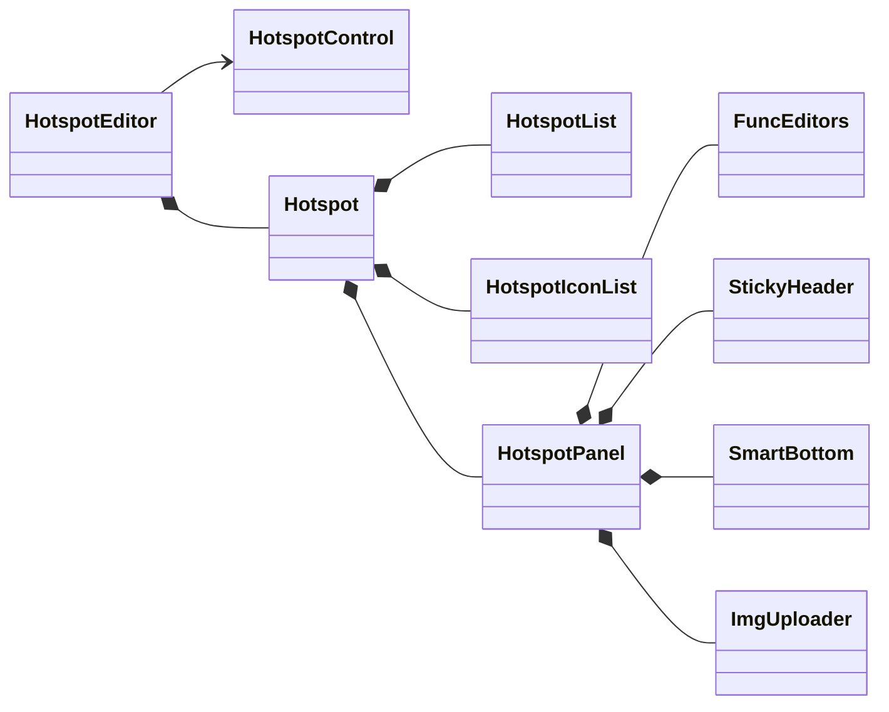

# VRCC 分析

## Depthpano.Hotspot

```mermaid
classDiagram
 direction LR
    class HotspotEditor{

    }

    class HotspotControl{
	
    }

    class HotspotList{

    }

    

    Hotspot *-- HotspotList
    Hotspot *-- HotspotIconList
    Hotspot *-- HotspotPanel
    
    HotspotEditor *-- Hotspot
    HotspotEditor --> HotspotControl
    HotspotPanel *-- FuncEditors
    HotspotPanel *-- StickyHeader
    HotspotPanel *-- SmartBottom
    HotspotPanel *-- ImgUploader

```

## Depthpano.Hotspot.Editors

```mermaid
classDiagram
 direction LR
   

    
    %% 各种Editor
    FuncEditors *-- PanoSwitch
    PanoSwitch --> ViewSelect
    PanoSwitch --> V3DViewer
    PanoSwitch --> Manager_V3DManager
    PanoSwitch --> Toast
    PanoSwitch --> LayoutBaseComponent
    
    FuncEditors *-- PanoLabel

    FuncEditors *-- PanoText
    PanoText --> LinkInformation

    FuncEditors *-- PanoArticle
    PanoArticle --> simpleUploadArticle
    PanoArticle --> RichText
    PanoArticle --> Icon

    FuncEditors *-- PanoPicture
    PanoPicture --> ImgUploadGrid
    PanoPicture --> LinkInformation
    PanoPicture --> ImageEffect

    
    FuncEditors *-- PanoGraphic
    PanoGraphic --> Util_sillegalUrl
    PanoGraphic --> AudioItem

    FuncEditors *-- PanoLink
    PanoLink --> Util_sillegalUrl

    FuncEditors *-- PanoAudio
    PanoAudio --> AudioItem

    FuncEditors *-- PanoVideo
    PanoVideo --> LinkInformation

    FuncEditors *-- PanoSpin
    PanoSpin --> MaterialsSelect
    

    FuncEditors *-- SpinGraphic
    SpinGraphic --> Gallery
    SpinGraphic --> Utils_commonTools

    
    FuncEditors *-- SpinVideo
    SpinVideo --> Utils_dataParser
    
    FuncEditors *-- DepthpanoPicture
    DepthpanoPicture --> ImgUploadGrid
    DepthpanoPicture --> LinkInformation
    DepthpanoPicture --> SceneSelect
    
    FuncEditors *-- DepthpanoVideo
    DepthpanoVideo --> LinkInformation
    DepthpanoVideo --> SceneSelect
    
    FuncEditors *-- DepthpanoText
    DepthpanoText --> LinkInformation
    DepthpanoText --> SceneSelect
    
    FuncEditors *-- DepthpanoGraphic
    DepthpanoGraphic --> LinkInformation
    DepthpanoGraphic --> AudioItem
    DepthpanoGraphic --> ImgUploadGrid
    DepthpanoGraphic --> ImageEffect
    DepthpanoGraphic --> SceneSelect
    
    FuncEditors *-- DepthpanoSpin
    DepthpanoSpin --> MaterialsSelect
    DepthpanoSpin --> SceneSelect


  


```
